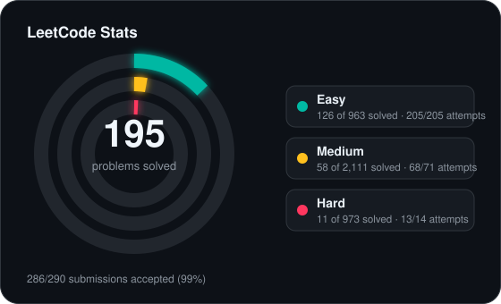
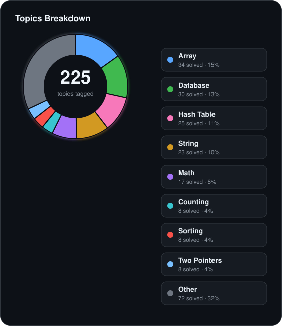

<!-- leetcode-stats:start -->
# LeetCode Solutions

Auto-synced by LeetCode to GitHub Sync.

<!-- leetcode-stats:end -->

| # | Title | Difficulty | Tags | Status |
| --- | --- | --- | --- | --- |
| 4 | [Median of Two Sorted Arrays](https://leetcode.com/problems/median-of-two-sorted-arrays/) | Hard | Array, Binary Search, Divide and Conquer | ✅ Accepted |<!-- id:median-of-two-sorted-arrays -->
| 2 | [Add Two Numbers](https://leetcode.com/problems/add-two-numbers/) | Medium | Linked List, Math, Recursion | ✅ Accepted |<!-- id:add-two-numbers -->
| 219 | [Contains Duplicate II](https://leetcode.com/problems/contains-duplicate-ii/) | Easy | Array, Hash Table, Sliding Window | ✅ Accepted |<!-- id:contains-duplicate-ii -->
| 128 | [Longest Consecutive Sequence](https://leetcode.com/problems/longest-consecutive-sequence/) | Medium | Array, Hash Table, Union-Find | ✅ Accepted |<!-- id:longest-consecutive-sequence -->
| 1 | [Two Sum](https://leetcode.com/problems/two-sum/) | Easy | Array, Hash Table | ✅ Accepted |<!-- id:two-sum -->
| 387 | [First Unique Character in a String](https://leetcode.com/problems/first-unique-character-in-a-string/) | Easy | Hash Table, String, Queue, Counting | ✅ Accepted |<!-- id:first-unique-character-in-a-string -->
| 205 | [Isomorphic Strings](https://leetcode.com/problems/isomorphic-strings/) | Easy | Hash Table, String | ✅ Accepted |<!-- id:isomorphic-strings -->

